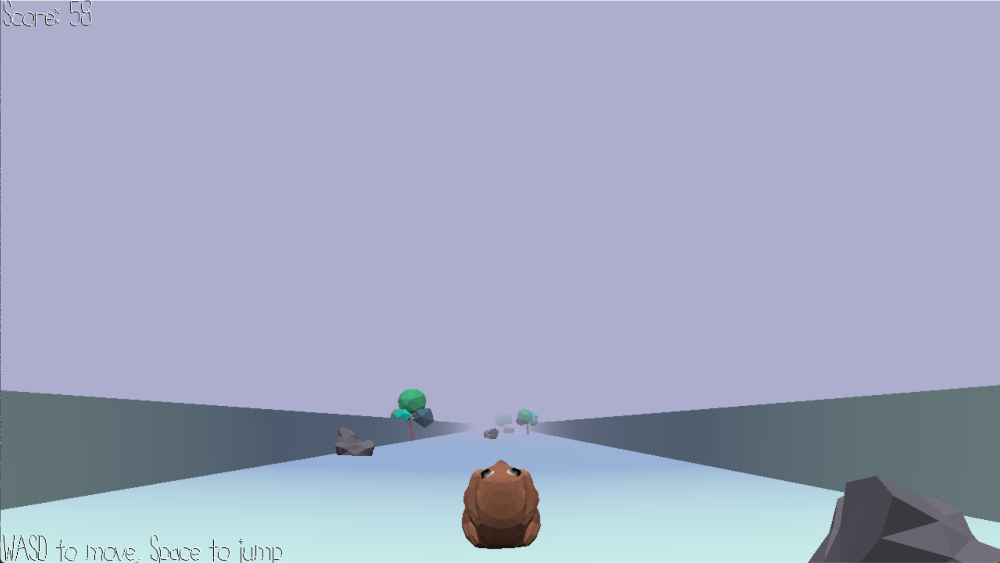
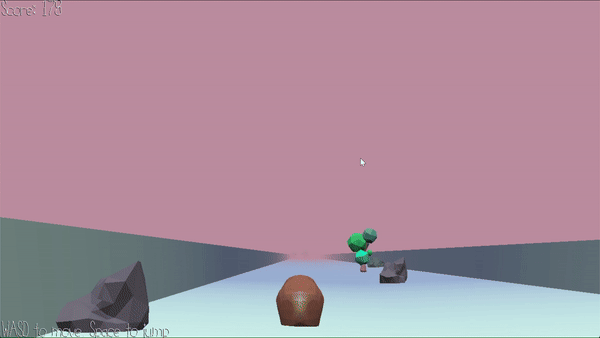

# After-Meal Exercise

Author: Weiwen "Andy" Jiang

Design: Hamster has had wayyy too many carrots in the 2D world, it has decided to go for a roll to burn some calories. Some pesky trees and rocks, however, seems to be in the way for a bad time downhill.

Screen Shot:

Gameplay Gif:

How To Play:

Use A and D to move horizontally, space to jump, r to restart. Dodge the rocks and trees (leaves have no collision). Try not to crash and get a high score!

This game was built with [NEST](NEST.md).
